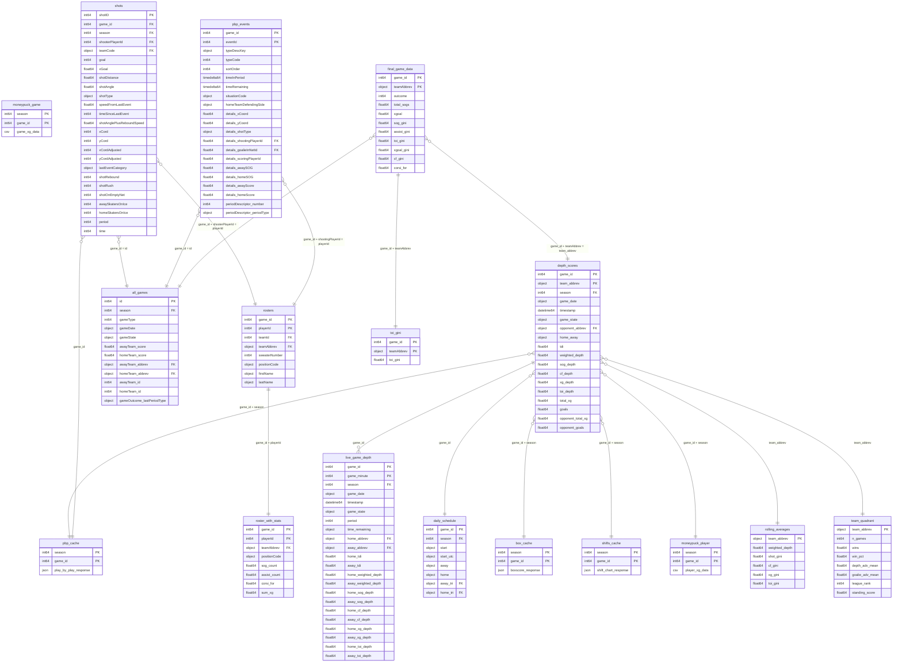

# Hockey Decoded Data Warehouse

S3 Bucket: `hockey-decoded` (us-east-2) | Access: `s3fs.S3FileSystem(anon=False)` | Config: `app/core/config.py`

---

## Entity-Relationship Diagram



---

## Table Definitions

### PRODUCTION — Updated Daily by Scheduled Jobs

---

#### `depth_scores` — Master depth metrics (2 rows per game)
**S3 Path:** `s3://hockey-decoded/depth_scores/depth_scores.parquet`
**Format:** Parquet (fastparquet, snappy) | **Updated:** Daily 5 AM ET + live game finalization
**Written by:** `write_final_depth()` in `app/nhl/service_depth.py`
**Read by:** `get_league_depth_data()` in `app/nhl/league_stats.py`
**Historical archives:** `depth_scores/season={SEASON}/depth_scores.parquet` (2017-18 through 2023-24)

| Column | Type | Key | Description |
|--------|------|-----|-------------|
| game_id | int64 | PK | NHL game ID (e.g., 2025021178) |
| team_abbrev | object | PK | 3-letter team code (e.g., TOR) |
| season | int64 | FK | Season year (e.g., 20252026) |
| game_date | object | | ISO date (e.g., 2026-03-28) |
| timestamp | datetime64[ns, UTC] | | When snapshot was calculated |
| game_state | object | | FINAL, OFF |
| opponent_abbrev | object | FK | Opponent's 3-letter code |
| home_away | object | | "home" or "away" |
| tdi | float64 | | Tier Depth Index (z-scored composite) |
| weighted_depth | float64 | | Linear combination of 4 depth z-scores |
| sog_depth | float64 | | Shots-on-goal depth (1 - Gini) |
| cf_depth | float64 | | Corsi-for depth (1 - Gini) |
| xg_depth | float64 | | Expected goals depth (1 - Gini) |
| toi_depth | float64 | | Time-on-ice depth (1 - Gini) |
| total_xg | float64 | | Team's total expected goals |
| goals | float64 | | Team's actual goals scored |
| opponent_total_xg | float64 | | Opponent's expected goals |
| opponent_goals | float64 | | Opponent's actual goals |

---

#### `live_game_depth` — Minute-by-minute depth time series per game
**S3 Path:** `s3://hockey-decoded/live_game_depth/season={SEASON}/game_id={GAME_ID}.parquet`
**Format:** Parquet | **Updated:** Every minute during live games; replaced post-game with shift-based backfill
**Written by:** `append_live_depth_snapshot()` / `backfill_game_minute_snapshots()`
**Read by:** `/dashboard/games/{season}/{game_id}/depth/timeseries` endpoint
**Coverage:** ~13,354 game files (2017-18 through 2025-26)

| Column | Type | Key | Description |
|--------|------|-----|-------------|
| game_id | int64 | PK | NHL game ID |
| game_minute | int64 | PK | Even minutes only (2, 4, 6... 60+) |
| season | int64 | FK | |
| game_date | object | | ISO date |
| timestamp | datetime64[ns, UTC] | | When snapshot was taken |
| game_state | object | | LIVE, CRIT, FINAL, etc. |
| period | int64 | | Current period (1, 2, 3, OT) |
| time_remaining | object | | MM:SS format |
| home_abbrev | object | FK | Home team code |
| away_abbrev | object | FK | Away team code |
| home_tdi / away_tdi | float64 | | TDI at this minute |
| home_weighted_depth / away_weighted_depth | float64 | | Weighted depth at this minute |
| home_sog_depth / away_sog_depth | float64 | | SOG depth at this minute |
| home_cf_depth / away_cf_depth | float64 | | CF depth at this minute |
| home_xg_depth / away_xg_depth | float64 | | xG depth at this minute |
| home_toi_depth / away_toi_depth | float64 | | TOI depth at this minute |
| debug_* columns | mixed | | Blending diagnostics (prior weights, shots, etc.) |

---

#### `daily_schedule` — NHL games per date
**S3 Path:** `s3://hockey-decoded/live-data-cache/daily-schedule/{YYYY-MM-DD}.parquet`
**Format:** Parquet | **Updated:** Once per date, cached permanently
**Written/read by:** `get_games_for_date()` in `app/nhl/get_todays_games.py`

| Column | Type | Key | Description |
|--------|------|-----|-------------|
| game_id | int64 | PK | NHL game ID |
| season | int64 | FK | Season year |
| start | object | | Start time string (e.g., "7:00 PM ET") |
| start_utc | object | | UTC start time |
| away | object | | Away team name |
| home | object | | Home team name |
| away_tri | object | FK | Away team 3-letter code |
| home_tri | object | FK | Home team 3-letter code |

---

#### `rolling_averages` — Current 10-game rolling depth per team
**S3 Path:** `s3://hockey-decoded/depth_scores/rolling_averages.json`
**Format:** JSON | **Updated:** Daily after backfill
**Written by:** `save_current_rolling_averages()` in `app/nhl/league_stats.py`
**Read by:** `get_current_rolling_averages()` — used for Bayesian blending during live games

| Field | Type | Key | Description |
|-------|------|-----|-------------|
| team_abbrev | object | PK | Key in `data` dict |
| weighted_depth | float64 | | 10-game rolling weighted depth |
| shot_gini | float64 | | 10-game rolling SOG Gini coefficient |
| cf_gini | float64 | | 10-game rolling CF Gini coefficient |
| xg_gini | float64 | | 10-game rolling xG Gini coefficient |
| toi_gini | float64 | | 10-game rolling TOI Gini coefficient |
| updated_at | string | | ISO timestamp of last update |
| season | int | | Current season |

---

#### `team_quadrant` — Depth vs goaltending positioning
**S3 Path:** `s3://hockey-decoded/depth_scores/team_quadrant.json`
**Format:** JSON (array of objects) | **Updated:** Daily after backfill
**Written by:** `save_team_quadrant_data()` in `app/nhl/league_stats.py`

| Field | Type | Key | Description |
|-------|------|-----|-------------|
| team_abbrev | object | PK | 3-letter team code |
| n_games | int | | Games played this season |
| wins | float | | Win count |
| win_pct | float | | Win percentage |
| depth_adv_mean | float | | Avg (team TDI - opponent TDI) |
| goalie_adv_mean | float | | Avg (team GSAx - opponent GSAx) |
| league_rank | int | | 1 = best in league |
| standing_score | float | | Normalized 0-1 (1 = best) |

---

### API CACHE — On-Demand with TTL

All cached in `s3://hockey-decoded/live-data-cache/game-center/{SEASON}/`
Each has a `.meta.json` sidecar with ETag + Last-Modified for conditional GET.

| Entity | S3 Path Pattern | Format | Source API | TTL (Live / Backfill) |
|--------|----------------|--------|------------|----------------------|
| pbp_cache | `{SEASON}/{GAME_ID}.json` | JSON | `api-web.nhle.com/v1/gamecenter/{id}/play-by-play` | 5s / 1h |
| box_cache | `{SEASON}/{GAME_ID}_box.json` | JSON | `api-web.nhle.com/v1/gamecenter/{id}/boxscore` | 5s / 1h |
| shifts_cache | `{SEASON}/{GAME_ID}_shifts.json` | JSON | `api.nhle.com/stats/rest/en/shiftcharts?gameId={id}` | 15s / 1h |
| moneypuck_player | `{SEASON}/moneypuck/{GAME_ID}_player.csv` | CSV | `moneypuck.com/moneypuck/playerData/games/{season}/{id}.csv` | 30s / 1h |
| moneypuck_game | `{SEASON}/moneypuck/{GAME_ID}_game.csv` | CSV | `moneypuck.com/moneypuck/gameData/{season}/{id}.csv` | 60s / 1h |

**Join key to all other tables:** `game_id` + `season`
**Note:** MoneyPuck has been returning 403 from ECS IP since ~March 30, 2026.

---

### RESEARCH — Static Historical Data (for xG Model)

---

#### `shots` — MoneyPuck shot-level data with xG features
**S3 Path:** `s3://hockey-decoded/static-ds-analyses/total-depth-index/all-seasons/shots_{YYYY}.csv`
**Format:** CSV (~60-69 MB per season) | **Coverage:** 2010-2024 (15 files) | **Updated:** Manual (Sep 2025)

Key columns (of ~120 total):

| Column | Type | Key | Description |
|--------|------|-----|-------------|
| shotID | int64 | PK | Unique shot identifier |
| game_id | int64 | FK | NHL game ID |
| season | int64 | FK | Season year |
| shooterPlayerId | int64 | FK | Joins to rosters.playerId |
| teamCode | object | FK | 3-letter team code |
| team | object | | Full team name |
| goal | int64 | | **Target variable** (0 or 1) |
| xGoal | float64 | | MoneyPuck's xG prediction (validation baseline) |
| shotDistance | float64 | | Distance from net (feet) |
| shotAngle | float64 | | Angle to center of goal |
| shotAngleAdjusted | float64 | | Arena-adjusted angle |
| shotType | object | | Wrist, Slap, Backhand, Snap, Tip, Wrap, Deflection |
| xCord / yCord | int64 | | Raw shot coordinates |
| xCordAdjusted / yCordAdjusted | int64 | | Normalized coordinates |
| arenaAdjustedXCord / YCord | float64 | | Arena-bias adjusted |
| speedFromLastEvent | float64 | | Distance from last event / time elapsed |
| timeSinceLastEvent | int64 | | Seconds since previous event |
| distanceFromLastEvent | float64 | | Feet from previous event location |
| lastEventCategory | object | | Previous event type |
| lastEventxCord / yCord | int64 | | Previous event location |
| shotRebound | int64 | | Is this a rebound shot (0/1) |
| shotRush | int64 | | Is this a rush shot (0/1) |
| shotAnglePlusRebound | float64 | | Angle change for rebounds |
| shotAnglePlusReboundSpeed | float64 | | Angle change / time (key rebound feature) |
| shotOnEmptyNet | int64 | | Empty net (0/1) |
| awaySkatersOnIce / homeSkatersOnIce | int64 | | Skater count |
| isPlayoffGame | int64 | | Regular season vs playoffs |
| period | int64 | | Period number |
| time | int64 | | Seconds elapsed in game |
| shooterLeftRight | object | | Shooter handedness |
| shotGoalProbability | float64 | | MoneyPuck's predicted probability |
| offWing | int64 | | Shooting from off-wing (0/1) |
| shootingTeam* / defendingTeam* | mixed | | TOI context for all skaters on ice |

---

#### `pbp_events` — NHL play-by-play events
**S3 Path:** `s3://hockey-decoded/parquet/all_pbp_20102025.parquet`
**Format:** Parquet (108 MB) | **Coverage:** 2010-2025 | **Updated:** Manual (Jan 2026)
**Also available as:** `static-ds-analyses/.../all_pbp_20102025.csv` (856 MB)

| Column | Type | Key | Description |
|--------|------|-----|-------------|
| game_id | int64 | PK | NHL game ID |
| eventId | int64 | PK | Event sequence ID within game |
| typeDescKey | object | | Event type: shot-on-goal, goal, missed-shot, hit, faceoff, etc. |
| typeCode | int64 | | Numeric event type code |
| sortOrder | int64 | | Chronological ordering |
| timeInPeriod | timedelta64 | | Time elapsed in current period |
| timeRemaining | timedelta64 | | Time remaining in period |
| situationCode | object | | Strength state (e.g., "1551" = 5v5 home, 5v5 away) |
| homeTeamDefendingSide | object | | "left" or "right" |
| periodDescriptor.number | int64 | | Period number |
| periodDescriptor.periodType | object | | REG, OT, SO |
| details.xCoord | float64 | | Event x-coordinate on ice |
| details.yCoord | float64 | | Event y-coordinate on ice |
| details.shotType | object | | Shot type (wrist, slap, etc.) |
| details.shootingPlayerId | float64 | FK | Shooter player ID |
| details.goalieInNetId | float64 | FK | Goalie facing shot |
| details.scoringPlayerId | float64 | | Goal scorer (for goal events) |
| details.assist1PlayerId | float64 | | Primary assist |
| details.assist2PlayerId | float64 | | Secondary assist |
| details.awaySOG / homeSOG | float64 | | Running shot count |
| details.awayScore / homeScore | float64 | | Running score |
| details.reason | object | | Stoppage reason |
| details.zoneCode | object | | Zone (O/D/N) |

---

#### `all_games` — Game-level metadata
**S3 Path:** `s3://hockey-decoded/parquet/all_games_clean.parquet`
**Format:** Parquet (4.1 MB) | **Coverage:** 2010-2025

| Column | Type | Key | Description |
|--------|------|-----|-------------|
| id | int64 | PK | NHL game ID (= game_id elsewhere) |
| season | int64 | FK | Season year |
| gameType | int64 | | 2 = regular season, 3 = playoffs |
| gameDate | object | | ISO date |
| gameState | object | | FINAL, OFF |
| awayTeam.abbrev | object | FK | Away team code |
| homeTeam.abbrev | object | FK | Home team code |
| awayTeam.score | float64 | | Final away score |
| homeTeam.score | float64 | | Final home score |
| awayTeam.id / homeTeam.id | int64 | | Numeric team IDs |
| gameOutcome.lastPeriodType | object | | REG, OT, SO |

---

#### `rosters` — Per-game player rosters
**S3 Path:** `s3://hockey-decoded/static-ds-analyses/total-depth-index/all-seasons/all_rosters_20102025.csv`
**Format:** CSV (98 MB) | **Coverage:** 2010-2025

| Column | Type | Key | Description |
|--------|------|-----|-------------|
| game_id | int64 | PK | NHL game ID |
| playerId | int64 | PK | NHL player ID |
| teamId | int64 | FK | Numeric team ID |
| teamAbbrev | object | FK | 3-letter team code |
| sweaterNumber | int64 | | Jersey number |
| positionCode | object | | C, L, R, D, G |
| firstName | object | | Player first name |
| lastName | object | | Player last name |

---

#### `roster_with_stats` — Rosters enriched with per-game stats
**S3 Path:** `s3://hockey-decoded/static-ds-analyses/total-depth-index/all-seasons/roster_with_sog_assist_corsi_xg.csv`
**Format:** CSV (127 MB) | **Coverage:** 2010-2025

| Column | Type | Key | Description |
|--------|------|-----|-------------|
| game_id | int64 | PK | NHL game ID |
| playerId | int64 | PK | NHL player ID |
| teamAbbrev | object | FK | 3-letter team code |
| positionCode | object | | Position |
| sog_count | float64 | | Shots on goal in this game |
| assist_count | float64 | | Assists in this game |
| corsi_for | float64 | | Corsi for events in this game |
| sum_xg | float64 | | Total xG generated in this game |
| *(plus all roster columns)* | | | |

---

#### `final_game_data` — Per-team game outcomes with Gini metrics
**S3 Path:** `s3://hockey-decoded/static-ds-analyses/total-depth-index/all-seasons/final_game_data_20102025.csv`
**Format:** CSV (5.4 MB) | **Coverage:** 2010-2025

| Column | Type | Key | Description |
|--------|------|-----|-------------|
| game_id | int64 | PK | NHL game ID |
| teamAbbrev | object | PK | 3-letter team code |
| outcome | int64 | | Win (1) or loss (0) |
| total_sogs | float64 | | Total shots on goal |
| xgoal | float64 | | Total expected goals |
| sog_gini | float64 | | SOG distribution inequality |
| assist_gini | float64 | | Assist distribution inequality |
| toi_gini | float64 | | TOI distribution inequality |
| xgoal_gini | float64 | | xG distribution inequality |
| cf_gini | float64 | | Corsi-for distribution inequality |
| corsi_for | float64 | | Total corsi-for events |

---

#### `toi_gini` — Per-team TOI inequality by game
**S3 Path:** `s3://hockey-decoded/static-ds-analyses/total-depth-index/all-seasons/toi_gini_{YYYY}.csv`
**Format:** CSV (~95 KB per season) | **Coverage:** 2010-2024

| Column | Type | Key | Description |
|--------|------|-----|-------------|
| game_id | int64 | PK | NHL game ID |
| teamAbbrev | object | PK | 3-letter team code |
| toi_gini | float64 | | Gini coefficient of TOI distribution |

---

## Join Key Reference

```
┌─────────────────────────────────────────────────────────────────────────┐
│                          JOIN KEY MAP                                    │
│                                                                         │
│  game_id ──── The universal key. Connects nearly everything.           │
│  │                                                                     │
│  ├── depth_scores.game_id                                              │
│  ├── live_game_depth.game_id                                           │
│  ├── daily_schedule.game_id                                            │
│  ├── all caches (pbp, box, shifts, moneypuck).game_id                 │
│  ├── shots.game_id                                                     │
│  ├── pbp_events.game_id                                                │
│  ├── all_games.id  ←── NOTE: column is "id", not "game_id"            │
│  ├── rosters.game_id                                                   │
│  ├── roster_with_stats.game_id                                         │
│  ├── final_game_data.game_id                                           │
│  └── toi_gini.game_id                                                  │
│                                                                         │
│  team_abbrev ── Connects team-level aggregations.                      │
│  │                                                                     │
│  ├── depth_scores.team_abbrev                                          │
│  ├── rolling_averages.team_abbrev (JSON key)                           │
│  ├── team_quadrant.team_abbrev                                         │
│  ├── rosters.teamAbbrev                                                │
│  ├── roster_with_stats.teamAbbrev                                      │
│  ├── final_game_data.teamAbbrev                                        │
│  ├── toi_gini.teamAbbrev                                               │
│  ├── shots.teamCode  ←── NOTE: column is "teamCode"                   │
│  ├── daily_schedule.away_tri / home_tri                                │
│  ├── all_games.awayTeam.abbrev / homeTeam.abbrev                      │
│  └── live_game_depth.home_abbrev / away_abbrev                        │
│                                                                         │
│  playerId ── Connects player-level data.                               │
│  │                                                                     │
│  ├── rosters.playerId                                                  │
│  ├── roster_with_stats.playerId                                        │
│  ├── shots.shooterPlayerId                                             │
│  ├── pbp_events.details.shootingPlayerId                               │
│  └── pbp_events.details.goalieInNetId                                  │
│                                                                         │
│  season ── Partitioning key for time-scoped queries.                   │
│  │                                                                     │
│  ├── depth_scores.season                                               │
│  ├── live_game_depth.season (partition key in S3 path)                │
│  ├── daily_schedule.season                                             │
│  ├── all caches (S3 path partition)                                    │
│  ├── shots.season                                                      │
│  ├── all_games.season                                                  │
│  └── shots files are also partitioned by year (shots_YYYY.csv)        │
│                                                                         │
│  ⚠️  GOTCHAS:                                                          │
│  • all_games uses "id" not "game_id"                                   │
│  • shots uses "teamCode" not "team_abbrev"                             │
│  • rosters uses "teamAbbrev" not "team_abbrev"                         │
│  • live_game_depth has "home_abbrev"/"away_abbrev" (wide format)      │
│  • depth_scores has "team_abbrev" (long format, one row per team)     │
└─────────────────────────────────────────────────────────────────────────┘
```

---

## Data Pipeline Flow

```
                         EXTERNAL APIs
    ┌──────────────────────┬──────────────────────┐
    │     NHL Web API      │     MoneyPuck         │
    │  (PBP, Box, Sched)   │  (Player/Game xG)    │
    │     NHL Stats API    │                       │
    │     (Shifts)         │  ⚠️ 403 since Mar 30  │
    └────────┬─────────────┴──────────┬────────────┘
             │                        │
             ▼                        ▼
    ┌─────────────────────────────────────────────┐
    │          S3: live-data-cache/                │
    │  (TTL-based cache with conditional GET)      │
    │                                             │
    │  game-center/{SEASON}/{GAME_ID}.json        │
    │  game-center/{SEASON}/{GAME_ID}_box.json    │
    │  game-center/{SEASON}/{GAME_ID}_shifts.json │
    │  game-center/{SEASON}/moneypuck/*.csv       │
    │  daily-schedule/{DATE}.parquet              │
    └─────────────────────┬───────────────────────┘
                          │
              ┌───────────┴───────────┐
              │                       │
              ▼                       ▼
    ┌──────────────────┐    ┌──────────────────────┐
    │  LIVE TRACKING   │    │  DAILY BACKFILL      │
    │  (every minute)  │    │  (5 AM ET)           │
    │                  │    │                      │
    │  During games:   │    │  Yesterday's games:  │
    │  PBP + Box + xG  │    │  PBP + Box + xG     │
    │       │          │    │  + Shifts (accurate) │
    │       ▼          │    │       │              │
    │  Depth Snapshot  │    │       ▼              │
    │  (blended with   │    │  Depth Snapshot      │
    │   rolling avg)   │    │  (shift-based TOI)   │
    └───────┬──────────┘    └───────┬──────────────┘
            │                       │
            ▼                       ▼
    ┌──────────────────────────────────────────────┐
    │        S3: live_game_depth/                   │
    │  season={S}/game_id={G}.parquet              │
    │  (minute-by-minute depth time series)        │
    └──────────────────────┬───────────────────────┘
                           │
            ┌──────────────┤ (on FINAL)
            ▼              ▼
    ┌────────────────────────────────────────┐
    │  S3: depth_scores/depth_scores.parquet │
    │  (master file — 2 rows per game)       │
    └───────────────────┬────────────────────┘
                        │
              ┌─────────┴─────────┐
              ▼                   ▼
    ┌──────────────────┐  ┌──────────────────────┐
    │ rolling_averages │  │   team_quadrant      │
    │     .json        │  │      .json           │
    │ (10-game rolling │  │ (depth vs goalie     │
    │  per team)       │  │  advantage scatter)  │
    └──────────────────┘  └──────────────────────┘


    RESEARCH DATA (static, manual uploads)
    ┌─────────────────────────────────────────────┐
    │  S3: static-ds-analyses/                     │
    │                                             │
    │  shots_YYYY.csv ←── xG model training data  │
    │  all_pbp_20102025.csv/parquet               │
    │  all_rosters_20102025.csv                   │
    │  all_shifts_20102025.ndjson                 │
    │  roster_with_sog_assist_corsi_xg.csv        │
    │  final_game_data_20102025.csv               │
    │  toi_gini_YYYY.csv                          │
    └─────────────────────────────────────────────┘
```

---

## S3 Path Quick Reference

| Entity | S3 Path | Format | Size | Update Cadence |
|--------|---------|--------|------|----------------|
| depth_scores | `depth_scores/depth_scores.parquet` | Parquet | ~377 KB | Daily 5 AM ET |
| depth_scores (archive) | `depth_scores/season={S}/depth_scores.parquet` | Parquet | ~140-207 KB each | Manual backfill |
| rolling_averages | `depth_scores/rolling_averages.json` | JSON | 7 KB | Daily 5 AM ET |
| team_quadrant | `depth_scores/team_quadrant.json` | JSON | 9 KB | Daily 5 AM ET |
| live_game_depth | `live_game_depth/season={S}/game_id={G}.parquet` | Parquet | ~11-12 KB each | Live + post-game |
| daily_schedule | `live-data-cache/daily-schedule/{DATE}.parquet` | Parquet | ~2-4 KB each | Once per date |
| pbp_cache | `live-data-cache/game-center/{S}/{G}.json` | JSON | varies | TTL 5s/1h |
| box_cache | `live-data-cache/game-center/{S}/{G}_box.json` | JSON | varies | TTL 5s/1h |
| shifts_cache | `live-data-cache/game-center/{S}/{G}_shifts.json` | JSON | varies | TTL 15s/1h |
| moneypuck_player | `live-data-cache/game-center/{S}/moneypuck/{G}_player.csv` | CSV | varies | TTL 30s/1h |
| moneypuck_game | `live-data-cache/game-center/{S}/moneypuck/{G}_game.csv` | CSV | varies | TTL 60s/1h |
| shots | `static-ds-analyses/.../shots_{YYYY}.csv` | CSV | ~60-69 MB/yr | Manual |
| pbp_events | `parquet/all_pbp_20102025.parquet` | Parquet | 108 MB | Manual |
| all_games | `parquet/all_games_clean.parquet` | Parquet | 4.1 MB | Manual |
| rosters | `static-ds-analyses/.../all_rosters_20102025.csv` | CSV | 98 MB | Manual |
| roster_with_stats | `static-ds-analyses/.../roster_with_sog_assist_corsi_xg.csv` | CSV | 127 MB | Manual |
| final_game_data | `static-ds-analyses/.../final_game_data_20102025.csv` | CSV | 5.4 MB | Manual |
| toi_gini | `static-ds-analyses/.../toi_gini_{YYYY}.csv` | CSV | ~95 KB/yr | Manual |
