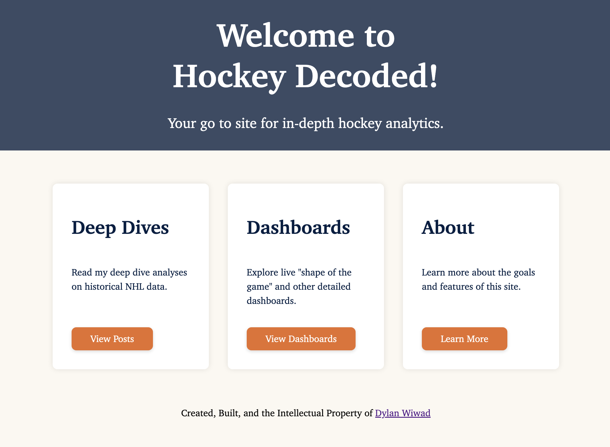

# Hockey Analytics Website

This project is a personal hockey data website built using primarily Python, HTML, and CSS.

Homepage site preview:

## Goals

- 📊 Static blog-style analysis of NHL teams, players, games, and historical trends
- 🖥  Live game dashboards using the NHL API that track the "shape of the game" with my novel metrics of Depth, Physicality, Defensive Success, etc.
- 📁 Separate pages for:
	- Blog Posts (static analyses)
	- Live Dashboards
	- Team and player stat lookups
	- About me

## Status

As of 06/26/2026 this project is in extremely early development. Currently focused on design and standing up the skeleton.

## Tech Stack (Planned)

- Python for backend code and data analysis. Maybe some R if it plays nicely together  (FastAPI for backend)
- HTML/CSS/JS for front end (Jinja2)

## To-Do and Working History

Website launch. Right now (July 1, 2025) I'm thinking I will launch and make live when I have:
- [ ] Five blog posts:
    - [ ] Demographics over time
    - [ ] Total Depth Index (TDI)
    - [ ] Career tenure over time
    - [ ] TBD
    - [ ] TBD
- [ ] Two Dashboards
    - [ ] Live in game TDI
    - [ ] Historical player level shot heatmap explorer
    
As well as 2 dashboards, one that shows the scoreboard and live TDI, and a historical player level shot heatmap.

### July 1, 2025 - Standup some content
- [X] Happy Canada Day!
- [ ] Build one static blog post in the blog page
	- [ ] My historical analysis weight, height, age, and country composition
- [ ] Connect it to the NHL API for live dashboarding
	- [ ] Perhaps a page that just pulls the last oilers game of the season and displays data

### June 27, 2025 - Design Work

- [X] Build the button for the landing cards
- [X] Build the button for the blog cards
- [X] Choose and implement a font
    - Went with Charter for everything for now
- [X] Write and implement the about me page
    - [X] Writing
    - [X] Circular masked photo
- [X] Make it so the nav site title points home

### June 26, 2025 - build the MVP

- [X] Set up the basic website structure backend
    - [X] Landing page
	- [X] About page
	- [X] Blog page
	- [X] Dashboard page
- [X] Add placeholder HTML frontend pages
    - [X] Landing page
	- [X] About page
	- [X] Blog page
	- [X] Dashboard page

## Author

Dylan Wiwad
