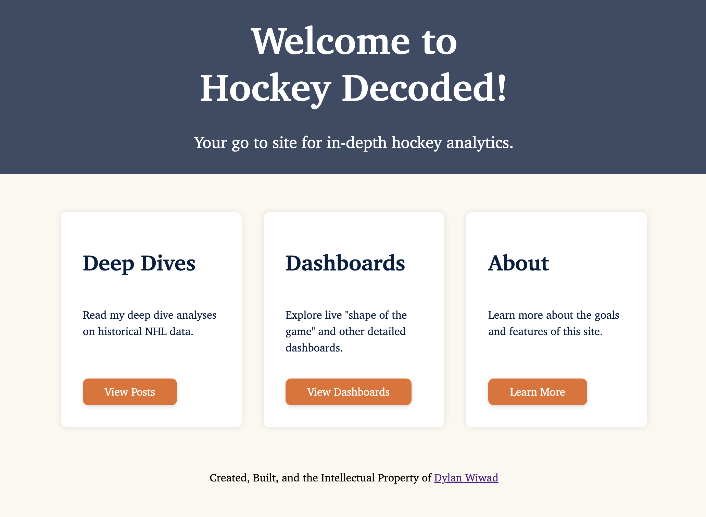

# Hockey Analytics Website

This project is a personal hockey data website built using primarily Python, HTML, and CSS.

Homepage site preview:

## Goals

- 📊 Static deep dive-style analysis of NHL teams, players, games, and historical trends
- 🖥  Live game dashboards using the NHL API that track the "shape of the game" with my novel metrics of Depth, Physicality, Defensive Success, etc.
- 📁 Separate pages for:
	- Deep Dive Posts (static analyses)
	- Live Dashboards
	- Team and player stat lookups
	- About me

## Status

As of 08/17/2026 this project is in very early development. I have the bare bones structure stood up for my deep dive posts. I'm beginning to play around with bringing in live data from the NHL api for my dashboarding. Would like to continue writing the deep dives I have planned, but then also starting the dashboarding build out.

I'm beginning to think about database management. Right now there is no database structure in place but I'm going to need to have this--what happens if someone wants to look at yesterdays games? Or games from earlier in the season? So I'm going to need a place to store all this json so people can see static snapshots of previous games. I did not expect this project to start simply with data science, morph into learning front and back end web development, and then start to touch on data engineering lol.

## Tech Stack (Planned)

- Python for backend code and data analysis. Maybe some R if it plays nicely together  (FastAPI for backend)
- HTML/CSS/JS for front end (Jinja2).
- Figma for design work

## To-Do and Working History

Website launch. Right now (July 1, 2025) I'm thinking I will launch and make live when I have:
- [ ] Five deep dive posts:
    - [X] Demographics over time
    - [ ] Total Depth Index (TDI)
    - [ ] Career tenure over time?
    - [ ] Quantifying generational talent vs everyone else?
    - [ ] TBD
- [ ] Two Dashboards
    - [ ] Live in game TDI
    - [ ] Historical player level shot heatmap explorer
- [ ] Databasing
	- [ ] How do I store previous games so people can look at history?

### Sept. 22, 2025 - Turn the dashboards live
- [X] Change functions from static and historical to live
- [X] Add a meta-tag in the markdown for raw analysis that links to a notebook

### Sept. 6, 2025 - Keep on keepin on
- [X] Write the demographics deep dive notebook file
- [ ] Total Depth Index
	- [X] Do the ground exploration and analysis to define TDI in last season; Need this for the blog post and dash
	- [ ] Pull the data for 2010 to 2025
- [ ] Design the "Shape of the Game" Dashboard
- [ ] Find the right icons for about page that are thin in each case
- [ ] Live dashboarding
	- [X] Learn how to bring in the live data
	- [X] Bring in a Cache for the main dashboard so it doesn't take so long to load the days games
	- [X] Debug the shot counter for the interim sog dash; tampa gave giving boston game counts for march 13, 2025 test day
		- Damn that was annoying. Turns out I thought I was duplicating a game but just by chance the shot counts for two games were the same
		because I included shootout shots, and didn't line up with the box score because nhl doesn't count shootouts. Just had to filter that out.
	- [X] Start fleshing out the dash page
	- [ ] Bring in the roster data for each game as well for sog by player id matching 
	- [ ] Build some sog by player figures to sit side by side live 
	- [X] Add Yesterdays games page + date selector; this might require rewriting my game fetcher and router
		- [ ] Stylize the date selector
	- [ ] Test Redo the scoreboard, goals on either side, clock and period in the middle like nhl.com
		- example: https://www.nhl.com/gamecenter/ott-vs-tor/2025/09/21/2025010010
	- [ ] Add simple javascripting to auto-refresh the clock every 5 seconds, builds the base for depth to do the same. (nhl.com updates every 10s)
	- [ ] Add javascripting to update goals if the data updates

### July 31, 2025 - Standup some content
- [ ] Optimize backend for scalability
	- [X] Break up main.py into separate routing files
	- [X] Create a single generic deep dive router
	- [ ] Add in meta for Google Analytics
	- [ ] Add in meta tags for later searching
	- [X] Add level 1 folder called data (e.g., /data/deep_dive_1/data.csv)
	- [X] Add level 1 folder called scripts (e.g., /scripts/deep_dive_1/1.Pull_data.py)
- [ ] Fix Front end for recurring new static analyses
	- [X] Build a deep dive html template
	- [X] Get markdown rolling for content writing that knits to custom styled html
	- [ ] Generalize style.css
- [X] Add links to about page with icons 
	- [X] Github, personal site, linkedin, google scholar
- [X] Stylize Today's Games with cards
 - [X] Cards
 - [X] Team logo images
 - [X] Buttons
 - [X] Do the design on Figma
	
### July 1, 2025 - Standup some content
- [X] Happy Canada Day!
- [X] Build one static deep dive post in the deep dive page
	- [X] My historical analysis weight, height, age, and country composition
- [X] Connect it to the NHL API for live dashboarding
	- [X] This will be just a test, but pull a schedule with a list of the days games

### June 27, 2025 - Design Work

- [X] Build the button for the landing cards
- [X] Build the button for the deep dive cards
- [X] Choose and implement a font
    - Went with Charter for everything for now
- [X] Write and implement the about me page
    - [X] Writing
    - [X] Circular masked photo
- [X] Make it so the nav site title points home

### June 26, 2025 - build the MVP

- [X] Set up the basic website structure backend
    - [X] Landing page
	- [X] About page
	- [X] deep dive page
	- [X] Dashboard page
- [X] Add placeholder HTML frontend pages
    - [X] Landing page
	- [X] About page
	- [X] deep dive page
	- [X] Dashboard page

## Author

Dylan Wiwad
